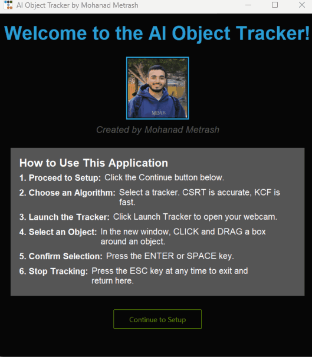

# 🤖 AI Real-Time Object Tracker

A user-friendly desktop application for real-time object tracking in a live webcam feed. This tool allows users to select an object with a bounding box and track its movement using various state-of-the-art tracking algorithms.



---

## ✨ Features

- **Intuitive GUI:** A clean, modern interface built with `ttkbootstrap` guides the user through the process.
- **Multiple Tracker Options:** Users can choose from seven different OpenCV tracking algorithms.
- **Real-Time Bounding Box:** The application draws a bounding box around the tracked object in real-time.
- **Performance Metrics:** Displays the live Frames Per Second (FPS) to gauge performance.
- **Status Updates:** Clearly indicates tracking success or failure on the video feed.

## 🛠️ Tech Stack

- **Language:** Python 3
- **Core Vision Library:** OpenCV (`opencv-contrib-python`)
- **GUI Framework:** Tkinter with `ttkbootstrap` for modern themes and widgets.
- **Image Handling:** Pillow (`PIL`) for displaying images in the GUI.

---

## 🚀 Deployment and Installation

To run this application on your local machine, please follow these steps:

1.  **Clone the Repository**
    ```bash
    git clone https://github.com/MohanadMetrash/Real-Time-Object-Tracker.git
    cd Real-Time-Object-Tracker
    ```

2.  **Create a Virtual Environment** (Recommended)
    ```bash
    python -m venv venv
    source venv/bin/activate  # On Windows, use `venv\Scripts\activate`
    ```

3.  **Install Dependencies**
    Install all required packages using the `requirements.txt` file.
    ```bash
    pip install -r requirements.txt
    ```

4.  **Run the Application**
    ```bash
    python tracker_app.py
    ```

---

## 📖 How to Use

1.  Launch the application. You will be greeted by the welcome screen.
2.  Click **Continue to Setup**.
3.  Select a tracking algorithm from the dropdown menu. The app will provide a brief description for each one, read directly from this README!
4.  Click **Launch Tracker**. Your webcam will activate.
5.  In the webcam window, **click and drag** your mouse to draw a box around the object you wish to track.
6.  Press **ENTER** or **SPACE** to confirm your selection.
7.  The tracking will begin. To stop, press the **ESC** key. This will close the tracking window and return you to the GUI.

---

## ⚙️ Algorithm Details

The following trackers are available. Choose one based on your specific needs for speed versus accuracy.

| Algorithm  | Description                                                                 |
|------------|-----------------------------------------------------------------------------|
| **CSRT**   | High accuracy and robust, but slower. The best choice for precision.        |
| **KCF**    | Excellent balance of speed and accuracy. A great default choice.            |
| **MOSSE**  | Blazing fast but less accurate. Use for high-speed, simple tracking.        |
| **MIL**    | Good at handling partial occlusions, but can drift over time.               |
| **BOOSTING**| Older algorithm based on AdaBoost. Slower and less reliable.                |
| **TLD**    | Designed for long-term tracking; can recover from disappearances.          |
| **MEDIANFLOW**| Best for slow, predictable motion. Fails with abrupt changes.               |

---

## 📝 Implementation Details

This project is built on the robust computer vision capabilities of **OpenCV**. The core tracking functionality leverages algorithms available in the `cv2.legacy` module.

The application architecture separates the user interface from the core logic:
-   **GUI (`tkinter`, `ttkbootstrap`)**: A multi-frame `tkinter` structure provides a non-blocking, user-friendly experience. The `SetupScreen` dynamically parses this README file to provide up-to-date tracker descriptions.
-   **Tracking Logic (`OpenCV`)**: The `run_object_tracking` function encapsulates all computer vision operations, including video capture, ROI selection, and the real-time tracking loop.
